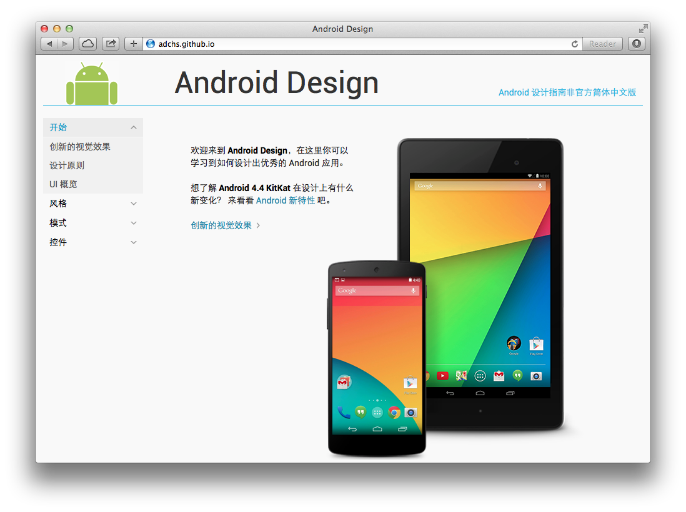

#Android 设计指南非官方简体中文版
基于 Android Design 翻译而成，部分图片和设计样式也来自于 Android Design。Android 是 Google 的商标。
如无特别说明，所有内容按照 [Creative Commons Attribution 2.5](http://creativecommons.org/licenses/by/2.5/) 协议授权。

<http://adchs.github.io>

##镜像
<http://www.sunjw.us/adchs>

<http://www.zhangzhibo.net/adchs>

<http://www.topfun.us/adchs>

<http://www.freemindworld.com/adchs>

<http://www.apkbus.com/design>

<http://mirrors.segmentfault.com/adchs>

##致谢
感谢 [topfun](http://www.topfun.us/) [lifanxi](http://www.freemindworld.com/) [安卓巴士](http://www.apkbus.com/) [SegmentFault](http://www.segmentfault.com) 提供镜像。

##历史版本
[Android Design for Android 4.1](https://github.com/sunjw/adchs/releases/tag/4.1)
